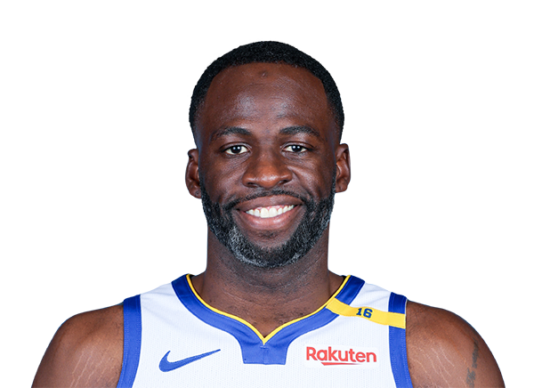

# Katy Stadler's User Page
***CSE110 Lab 1 _[(my goals)](#110-goals)_***
Hello! I am a 3rd year Cognitive Science and Computer Science student at UCSD. I am interested in the way people think and how we can model this computationally. I also love sports, specifically the Warriors and Niners (rip). Here's a link to my [personal site](https://kstad21.github.io/).

Here's a quote from my favorite player, Draymond Green:
> In the NBA, there's always a guy who is only around because he can jump. He doesn't have a clue about fundamentals. I learn more from the WNBA. They know how to dribble, how to pivot, how to use the shot fake. 

Slay???
[_another Draymond pic..._](draymond-2.png)

### Some of my favorite projects:
- Content Tutoring Center application: In order to make information retrieval simpler and more centralized at the tutoring center I work at, I am making an application to hold all the information (tutors, schedules, courses, attendance, etc) and a front-end for user interaction. 
- Using deep-Q networks to train Tetris AI (and showing that you need good heuristics to do so)
- Automation scripts to reduce manual labor for administrative tasks
  - I used Google scripts and used `SpreadsheetApp`, `DriveApp`, and several other libraries.

My goals for CSE110:
- [x] Form a team and start coordinating!
- [ ] Team bonding + team name for our first meeting
- [ ] Set team expectations/rules, talk about each of our own experiences
- [ ] Start brainstorming and come up with an idea
- [ ] This will get clearer down the line as to how we will do this but: use teamwork and execute and implement!

Some things I hope to get more experience in: 
1. Team leadership
2. Web stack
3. Javascript
4. HTML
5. Development Tools 
6. Development process